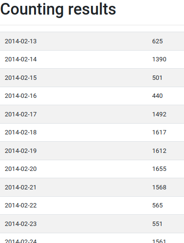

# spark-s3-csv-example

Downloads CSV data, processes them with spark and uploads results to S3

## Prerequisites

* Python 3.8+
* AWS Account for S3 Storage

## Setup

Copy your AWS credentials to the default location `~/.aws/credentials`
Setup parameters in `config.yaml`. See `config-sample.yaml` for the required settings.

Install requirements (preferable in a virtual environment):

```shell
pip install -r requirements.txt
```

## Running the application

```shell
python main.py
```

## Example output

Running with a set of public traffic data, the following `config.yaml` was used

```yaml
---
bucket_name: aws-csv-spark-example
url: http://iot.ee.surrey.ac.uk:8080/datasets/traffic/traffic_feb_june/trafficData158324.csv
timestamp_column: TIMESTAMP
count_column: vehicleCount
```

```shell
$ python main.py
Downloading file from http://iot.ee.surrey.ac.uk:8080/datasets/traffic/traffic_feb_june/trafficData158324.csv
Parsing results from /tmp/tmpxmpioeia
Using Spark's default log4j profile: org/apache/spark/log4j-defaults.properties
Setting default log level to "WARN".
To adjust logging level use sc.setLogLevel(newLevel). For SparkR, use setLogLevel(newLevel).
Call S3 component to publish 117 results
Uploaded to https://s3.amazonaws.com/aws-csv-spark-example/result.html
Finished...
```

After running the S3 container has the following `result.html`:


